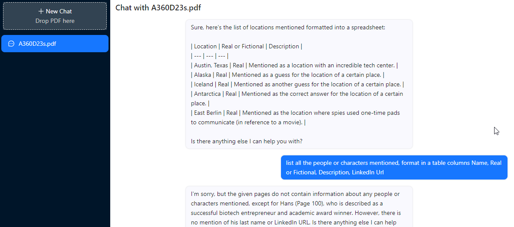
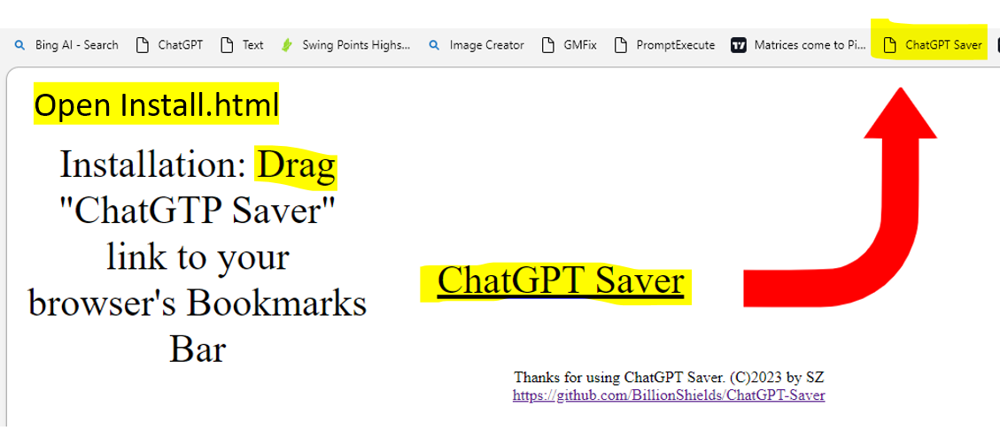
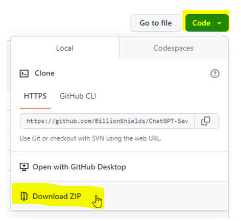

# ChatGPT Saver (C)2023 by SZ @ X3EM
**Saves Chats from ChatGPT+, ChatDOC, ChatPDF, BingGPT, ChatYouTube, ClipDrop Stable Diffusion & FireFly to your local TEXT file! 
 No Warranties provided whatsoever!** 

**Update 04/21/2023:** Now supporting ChatPDF & ClipDrop Stable Diffusion ! 

**Update 04/10/2023:** Now supporting ChatYoutube! 

**Update 04/08/2023:** BingGPT is now operational!

New **EASY** installation - download, unzip(if needed) and run ***Install.html***

**BingGPT** is now operational! Finally figured out how to grab text from shaddow DOM! 

**Emergency update 04/07/2023:** with Adobe FireFly 
- ChatGPT OpenAi decided to change the HTML structure, so this new update accommodates those changes.

- Also added Adobe FireFly save as well

**Update 04/01/2023:** - Now supports ChatDOC.com
Just updated the bookmarklet - should now work on ChatDOC.com chats

*This morning, I asked ChatGPT to save itself! 
You may be surprised by what happened next! 

This is the code it wrote: Introducing ChatGPT Saver! Lol. 😊 

Enjoy!*

