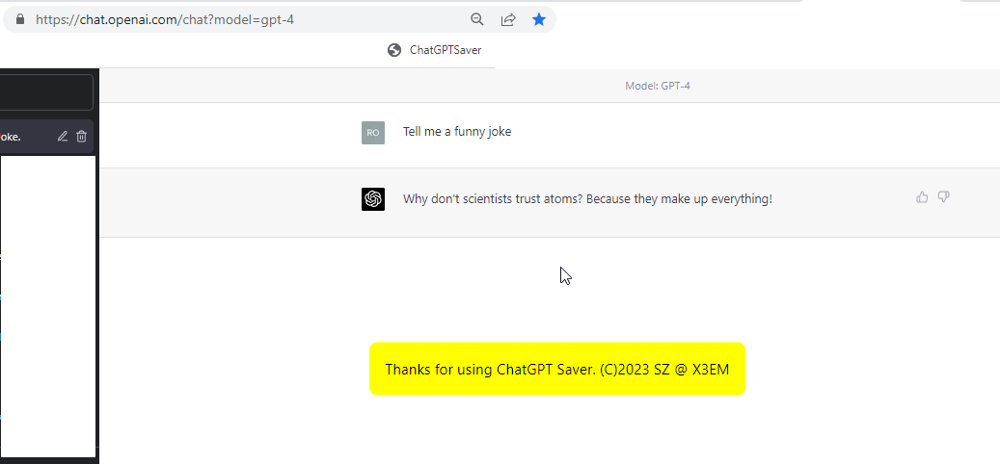

# ChatGPT Saver (C)2023 by SZ @ X3EM
# Saves Chats from ChatGPT+, ChatDOC, BingGPT & FireFly to your local TEXT file
# No Warranties provided whatsoever 

Drag to your Browser's Bookmarks bar to install

[ChatGPT Saver](javascript%3A(function()%7Bvar%20a%2Cb%3Bvar%20c%3D%5B%22openai.com%22%2C%22chatdoc.com%22%2C%22firefly.adobe.com%22%2C%22bing.com%22%5D%3Bvar%20d%3D%5B%22yellow%22%2C%22yellow%22%2C%22yellow%22%2C%22yellow%22%2C%22red%22%5D%3Blet%20e%3D%22position%3Afixed%3Btop%3A50%25%3Bleft%3A50%25%3Btransform%3Atranslate(-50%25%2C-50%25)%3Bpadding%3A20px%3Bmargin-top%3A20px%3Bmargin-bottom%3A20px%3Bborder-radius%3A10px%3Bbackground-color%3A%23%23%23%3Bz-index%3A9999%3Bfont-size%3Alarger%3B%22%3Bvar%20f%3De.slice().replace(%22%23%23%23%22%2C%22red%22)%3Bvar%20g%3De.slice().replace(%22%23%23%23%22%2C%22yellow%22)%3Bfunction%20h(i%2Cj%2Ck)%7Bvar%20l%3Ddocument.createElement(%22div%22)%3Bl.innerText%3Di%3Bl.style.backgroundColor%3Dk%3Bswitch(k)%7Bcase%27yellow%27%3Al.style.cssText%3Dg%3Bbreak%3Bcase%27red%27%3Al.style.cssText%3Df%3Bbreak%3B%7Ddocument.body.appendChild(l)%3BsetTimeout(function()%7Bl.remove()%7D%2Cj)%7Dfunction%20m(n%2Co%2Cp)%7Bif(o.trim()%3D%3D%3D%22%22)%7Bh(%22Saving%20Failed.%20No%20text%20extracted%22%2C1e4%2C%27red%27)%7Delse%7Bvar%20q%3D%22Thanks%20for%20using%20ChatGPT%20Saver.%20(C)2023%20by%20SZ%5Cnhttps%3A%2F%2Fgithub.com%2FBillionShields%2FChatGPT-Saver%5Cn%5Cn%22%3Bvar%20r%3Dq%2Bo%3Bvar%20s%3Dnew%20Blob(%5Br%5D%2C%7Btype%3A%22text%2Fplain%22%7D)%3Bvar%20t%3Ddocument.createElement(%22a%22)%3Bvar%20u%3Dnew%20Date().toLocaleString().replace(%2F%3A%2Fg%2C%22-%22).replace(%2F%5C%2F%2Fg%2C%22-%22)%3Bt.download%3D%22ChatGPT_%22%2Bn%2B%22_%22%2Bu%2B%22.txt%22%3Bt.href%3DURL.createObjectURL(s)%3Bt.click()%3Bh(q%2C3e3%2C%27yellow%27)%7D%7Dfunction%20v()%7Ba%3Ddocument.querySelector(%27.bg-gray-800%20.flex-1%27).textContent.substring(0%2C30)%3Bb%3DArray.from(document.querySelectorAll(%22.text-base%22)).map(function(w)%7Bvar%20x%3Dw.cloneNode(true)%3Bvar%20y%3Dx.querySelector(%22.flex-grow.flex-shrink-0%22)%3Bif(y)%7By.remove()%7Dreturn%20x.textContent%7D).join(%22%5Cn%5Cn%22)%3Bm(a%2Cb%2Cd%5B0%5D)%7Dfunction%20z()%7Ba%3Ddocument.getElementsByClassName(%22file-list-item%20active%22)%5B0%5D.getElementsByClassName(%22file-item-name-content%22)%5B0%5D.textContent%3Bb%3DArray.from(document.getElementsByClassName(%22message%22)).map(function(A)%7Breturn%20A.textContent%7D).join(%22%5Cn%5Cn%22)%3Bm(a%2Cb%2Cd%5B1%5D)%7Dfunction%20B()%7Bvar%20C%3Dnew%20Date().toLocaleString()%3Ba%3D%22Firefly%20Generative%20AI%20chat%20%22%2BC%3Bvar%20D%3Ddocument.querySelector(%22div%5Brole%3D%27form%27%5D%22)%3Bb%3Dwindow.location.href%2B%22%5Cn%5Cn%22%2BD.querySelector(%22textarea%22).value%2B%22%5Cn%5Cn%22%3Bvar%20E%3DD.querySelectorAll(%22textarea%22)%3Bif(E.length%3E1)%7BE%5B1%5D.remove()%7Db%2B%3DD.innerText.trim()%2B%22%5Cn%5Cn%22%3Bvar%20F%3Ddocument.getElementsByTagName(%22img%22)%3Bvar%20G%3Dnew%20Set()%3Bfor(var%20H%3D0%3BH%3CF.length%3BH%2B%2B)%7Bvar%20I%3DF%5BH%5D.src%3Bif(I.startsWith(%22blob%3A%22)%26%26!G.has(I))%7BG.add(I)%7D%7Db%2B%3DArray.from(G).join(%22%5Cn%22)%3Bm(a%2Cb%2Cd%5B2%5D)%7Dfunction%20J()%7Ba%3D%22BingGPT%22%3Bconst%20K%3D%5B%27text-message-content%27%2C%27ac-container%27%5D%3Blet%20b%3D%27%27%3Bconst%20L%3DK.map(N%3D%3EO(document%2CN))%3Bconst%20M%3DMath.max(L%5B0%5D.length%2CL%5B1%5D.length)%3Bfor(let%20P%3D0%3BP%3CM%3BP%2B%2B)%7Bif(L%5B0%5D%5BP%5D)%7Bb%2B%3D%27Q%3A%20%27%2BL%5B0%5D%5BP%5D.textContent%2B%27%5Cn%27%7Dif(L%5B1%5D%5BP%5D)%7Bb%2B%3D%27A%3A%20%27%2BL%5B1%5D%5BP%5D.textContent%2B%27%5Cn%27%7D%7Dm(a%2Cb%2Cd%5B3%5D)%7Dfunction%20O(Q%2CR)%7Bconst%20S%3D%5B%5D%3BQ.querySelectorAll(%27*%27).forEach(T%3D%3E%7Bif(T.shadowRoot)%7BS.push(...O(T.shadowRoot%2CR))%7Dif(T.classList.contains(R)%7C%7CT.matches(R))%7BS.push(T)%7D%7D)%3Breturn%20S%7Dfor(var%20U%3D0%3BU%3Cc.length%3BU%2B%2B)%7Bif(window.location.href.includes(c%5BU%5D))%7Bswitch(U)%7Bcase%200%3Av()%3Bbreak%3Bcase%201%3Az()%3Bbreak%3Bcase%202%3AB()%3Bbreak%3Bcase%203%3AJ()%3Bbreak%3B%7D%7Delse%7B%7D%7D%7D)()%3B)

# Update 04/07/2023 BingGPT is now operational!
Finally figured out how to grab text from shaddow DOM! 

# Emergency update 04/07/2023 with Adobe FireFly 
- ChatGPT OpenAi decided to change the HTML structure, so this new update accommodates those changes.

- Also added Adobe FireFly save as well

# Update 04/01/2023 - Now supports ChatDOC.com
Just updated the bookmarklet - should now work on ChatDOC.com chats

This morning, I asked ChatGPT to save itself! 
You may be surprised by what happened next! 

This is the code it wrote: Introducing ChatGPT Saver! Lol. 😊 

Download & Drag file to the bookmarks bar! 
Click on it when you need your chat saved as local text file i.e.  [Sample "ChatGPT_2023-3-27_8-48-37.txt" ](ChatGPT_2023-3-27_8-48-37.txt)

Enjoy!
