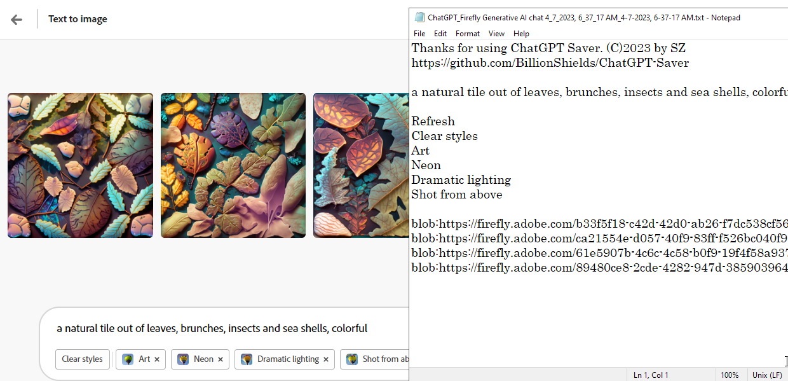

# ChatGPT Saver (C)2023 by SZ @ X3EM
# Saves Chats from ChatGPT+, ChatDOC, BingGPT & FireFly to your local TEXT file
# No Warranties provided whatsoever 

Drag to your Browser's Bookmarks bar to install

[ChatGPT Saver](javascript:(function()%28var%20a,b;var%20c=["openai.com","chatdoc.com","firefly.adobe.com","bing.com"];var%20d=["yellow","yellow","yellow","yellow","red"];let%20e="position:fixed;top:50%;left:50%;transform:translate(-50%,-50%);padding:20px;margin-top:20px;margin-bottom:20px;border-radius:10px;background-color:###;z-index:9999;font-size:larger;";var%20f=e.slice().replace("###","red");var%20g=e.slice().replace("###","yellow");function%20h(i,j,k)%28var%20l=document.createElement("div");l.innerText=i;l.style.backgroundColor=k;switch(k)%28case'yellow':l.style.cssText=g;break;case'red':l.style.cssText=f;break;%29document.body.appendChild(l);setTimeout(function()%28l.remove()%29,j)%29function%20m(n,o,p)%28if(o.trim()==="")%28h("Saving%20Failed.%20No%20text%20extracted",1e4,'red')%29else%28var%20q="Thanks%20for%20using%20ChatGPT%20Saver.%20(C)2023%20by%20SZ\nhttps://github.com/BillionShields/ChatGPT-Saver\n\n";var%20r=q+o;var%20s=new%20Blob([r],%28type:"text/plain"%29);var%20t=document.createElement("a");var%20u=new%20Date().toLocaleString().replace(/:/g,"-").replace(/\//g,"-");t.download="ChatGPT_"+n+"_"+u+".txt";t.href=URL.createObjectURL(s);t.click();h(q,3e3,'yellow')%29%29function%20v()%28a=document.querySelector('.bg-gray-800%20.flex-1').textContent.substring(0,30);b=Array.from(document.querySelectorAll(".text-base")).map(function(w)%28var%20x=w.cloneNode(true);var%20y=x.querySelector(".flex-grow.flex-shrink-0");if(y)%28y.remove()%29return%20x.textContent%29).join("\n\n");m(a,b,d[0])%29function%20z()%28a=document.getElementsByClassName("file-list-item%20active")[0].getElementsByClassName("file-item-name-content")[0].textContent;b=Array.from(document.getElementsByClassName("message")).map(function(A)%28return%20A.textContent%29).join("\n\n");m(a,b,d[1])%29function%20B()%28var%20C=new%20Date().toLocaleString();a="Firefly%20Generative%20AI%20chat%20"+C;var%20D=document.querySelector("div[role='form']");b=window.location.href+"\n\n"+D.querySelector("textarea").value+"\n\n";var%20E=D.querySelectorAll("textarea");if(E.length>1)%28E[1].remove()%29b+=D.innerText.trim()+"\n\n";var%20F=document.getElementsByTagName("img");var%20G=new%20Set();for(var%20H=0;H<F.length;H++)%28var%20I=F[H].src;if(I.startsWith("blob:")&&!G.has(I))%28G.add(I)%29%29b+=Array.from(G).join("\n");m(a,b,d[2])%29function%20J()%28a="BingGPT";const%20K=['text-message-content','ac-container'];let%20b='';const%20L=K.map(N=>O(document,N));const%20M=Math.max(L[0].length,L[1].length);for(let%20P=0;P<M;P++)%28if(L[0][P])%28b+='Q:%20'+L[0][P].textContent+'\n'%29if(L[1][P])%28b+='A:%20'+L[1][P].textContent+'\n'%29%29m(a,b,d[3])%29function%20O(Q,R)%28const%20S=[];Q.querySelectorAll('*').forEach(T=>%28if(T.shadowRoot)%28S.push(...O(T.shadowRoot,R))%29if(T.classList.contains(R)||T.matches(R))%28S.push(T)%29%29);return%20S%29for(var%20U=0;U<c.length;U++)%28if(window.location.href.includes(c[U]))%28switch(U)%28case%200:v();break;case%201:z();break;case%202:B();break;case%203:J();break;%29%29else%28%29%29%29)();)

# Update 04/07/2023 BingGPT is now operational!
Finally figured out how to grab text from shaddow DOM! 

# Emergency update 04/07/2023 with Adobe FireFly 
- ChatGPT OpenAi decided to change the HTML structure, so this new update accommodates those changes.

- Also added Adobe FireFly save as well

# Update 04/01/2023 - Now supports ChatDOC.com
Just updated the bookmarklet - should now work on ChatDOC.com chats

This morning, I asked ChatGPT to save itself! 
You may be surprised by what happened next! 

This is the code it wrote: Introducing ChatGPT Saver! Lol. 😊 

Download & Drag file to the bookmarks bar! 
Click on it when you need your chat saved as local text file i.e.  [Sample "ChatGPT_2023-3-27_8-48-37.txt" ](ChatGPT_2023-3-27_8-48-37.txt)

Enjoy!
